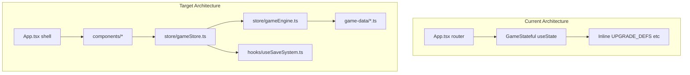

# Stellar Genesis — Full Game Implementation Plan

## Current State

The repo is a **Figma Make export** with a working prototype in [`src/app/App.tsx`](src/app/App.tsx). Already implemented:

- Star clicking with particles, corona animation, passive EPS tick
- 8 energy upgrades with exponential scaling (`cost × 1.15^owned`)
- 12 evolution stages with [`PlanetSVG`](src/app/App.tsx) visual changes (ocean, life, cities)
- Up to 5 planets, orbit animation, planets panel with evolve flow
- Resource HUD (Energy, Biomass, Research, Population, Essence — latter always 0)
- Research UI (5 nodes, **bonuses not applied**), achievements display, Oort endgame screen (transcend **does not reset or grant essence**)
- Mature color palette, glassmorphism panels, Space Grotesk / JetBrains Mono typography

**Critical gaps:** no persistence, no starting planet, monolithic architecture, broken asset import (`@/imports/download__78_.jpg` missing), dead duplicate `Game()` function, no planet types/specialization/automation/events/prestige logic, research state isolated in panel local state, planets not clickable in solar system view.



---

## Phase 1: Project Foundation

**Goal:** Fix build issues, add tooling, establish folder structure without breaking the playable prototype.

### 1.1 Tooling and dependencies

- Add [`tsconfig.json`](tsconfig.json) with path alias `@/*` → `src/*`
- Add dev dependencies: `typescript`, `@types/react`, `@types/react-dom`
- Add runtime: **`zustand`** (preferred state manager per spec)
- Keep existing Vite + Tailwind v4 stack; do not remove shadcn/ui — selectively adopt `Button`, `Dialog`, `Tabs`, `Tooltip`, `Switch`, `ScrollArea`, `Sonner` for settings/prestige confirmations

### 1.2 Fix broken assets

- Remove dependency on missing `@/imports/download__78_.jpg`
- Replace start-screen background with CSS gradient + illustrated star field (reuse existing `DOTS`/`CLOUDS` logic from App.tsx, or pure CSS/SVG)
- Replace Unsplash backgrounds in [`SpaceBackground`](src/app/App.tsx) with CSS-generated star field + nebula gradients (keeps game self-contained, no external image dependency)

### 1.3 Folder structure (new files extracted from App.tsx)

```
src/
├── app/App.tsx              # Thin shell: screen routing only
├── components/
│   ├── layout/              # TopBar, NavRail, GameLayout
│   ├── solar-system/        # SolarSystem, PlanetSVG, SpaceBackground
│   ├── panels/              # UpgradesPanel, PlanetPanel, ResearchPanel, etc.
│   ├── screens/             # StartScreen, PrestigeScreen (repurpose OortScreen)
│   └── ui/                  # existing shadcn (reuse)
├── game-data/
│   ├── upgrades.ts          # All upgrade categories
│   ├── evolution-stages.ts
│   ├── planet-types.ts
│   ├── specializations.ts
│   ├── research.ts
│   ├── automation.ts
│   ├── achievements.ts
│   ├── prestige.ts
│   ├── events.ts
│   ├── star-classes.ts
│   └── balance.ts           # Global formulas & tuning constants
├── store/
│   ├── gameStore.ts         # Zustand store
│   └── selectors.ts         # EPS, click power, unlock checks
├── hooks/
│   ├── useGameLoop.ts       # Passive income tick
│   ├── useOrbitAnimation.ts
│   ├── useSaveSystem.ts
│   └── useOfflineProgress.ts
├── utilities/
│   ├── format.ts            # fmt() with K/M/B/T/Qa/Qi
│   ├── costs.ts             # upgCost, evolveCost, planetCost
│   └── production.ts        # Deterministic production formulas
└── types/
    └── game.ts              # Planet, Upgrade, Research, SaveData, etc.
```

**Migration strategy:** Extract incrementally — move constants first, then components, then wire Zustand, then delete dead `Game()` duplicate (~lines 1176–1409) and inline duplicates.

---

## Phase 2: Core Game State and Loop

**Goal:** Single source of truth in Zustand; deterministic production; MVP gameplay loop.

### 2.1 Game state shape (`types/game.ts`)

```typescript
interface GameState {
  // Resources
  stellarEnergy: number;
  totalEarned: number;
  minerals: number;        // unlocked at milestone
  biomass: number;
  researchData: number;
  population: number;
  influence: number;       // late unlock
  exoticMatter: number;    // late unlock
  cosmicEssence: number;   // prestige currency (persistent)

  // Owned items
  upgrades: Record<string, number>;
  research: Record<string, boolean>;
  automation: Record<string, number>;
  prestigeUpgrades: Record<string, number>;
  achievements: Record<string, boolean>;

  // World
  starClass: string;
  planets: Planet[];
  selectedTarget: 'star' | string; // planet id

  // Meta
  settings: GameSettings;
  lastSaveTime: number;
  lastTickTime: number;
  rebirthCount: number;
  stats: GameStats;
}
```

### 2.2 Starting conditions (per spec)

- **1 central star** (Yellow Dwarf default)
- **1 starting barren planet** at stage 0 on innermost orbit (currently player starts with 0 planets — fix this)
- First upgrade affordable within **15–30 seconds** — tune [`balance.ts`](src/game-data/balance.ts):
  - Starting click power: 1
  - First upgrade "Stellar Probe": cost **10–15**, +0.2/s passive
  - First evolution cost: ~**100–200** energy, reachable in first few minutes

### 2.3 Upgrade expansion (minimum 10+, categorized)

Migrate existing 8 upgrades from [`UPGRADE_DEFS`](src/app/App.tsx) and add 2+ to reach spec minimum. Organize in [`game-data/upgrades.ts`](src/game-data/upgrades.ts) by category:

| Category | Examples (from spec) | MVP count |
|----------|---------------------|-----------|
| Stellar | Stronger Solar Flares, Fusion Output, Dyson Swarm | 4 |
| Planetary | Atmospheric Engineering, Terraforming | 2 |
| Biological | Organic Molecules, Cellular Life | 2 |
| Civilization | Agriculture, Spaceflight | 2 |
| Space Infrastructure | Orbital Stations, Asteroid Mining | 2 |

Each upgrade: `{ id, name, desc, category, baseCost, costMultiplier, effect, unlockRequirements }`

Production computed in [`utilities/production.ts`](src/utilities/production.ts) — never hardcoded in components.

### 2.4 Planet evolution (6+ stages for MVP, 11 for full)

Map existing 12 [`STAGE_NAMES`](src/app/App.tsx) to spec names in [`game-data/evolution-stages.ts`](src/game-data/evolution-stages.ts):

Barren World → Geologically Active → Atmospheric → Ocean → Microbial Life → Complex Life → Intelligent Life → Industrial → Spacefaring → Advanced Society → Post-Scarcity

Each stage defines: `cost`, `passiveBonus`, `description`, `minRequirements` (e.g., stage 4 requires "Atmospheric Engineering" upgrade owned), `visualFlags` (ocean/life/cities — reuse existing PlanetSVG logic).

### 2.5 Planet types and purchasing

Add [`game-data/planet-types.ts`](src/game-data/planet-types.ts): Rocky, Ocean, Desert, Ice, Gas Giant, Volcanic, Forest, Artificial.

- Starting planet: **Rocky** (barren)
- **3 purchasable additional planets** (4 total for MVP) — player picks type at purchase via modal
- Each type: unique `productionModifiers`, color palette, upgrade path tags
- Cost formula: `basePlanetCost × typeMultiplier × ownedCount^exponent`

### 2.6 Planet specialization

Unlock at stage ≥ Intelligent Life (stage 7). Add [`game-data/specializations.ts`](src/game-data/specializations.ts): Mining, Agricultural, Research, Industrial, Energy, Military, Trade, Ecological, Population Center.

- One specialization per planet, changeable with energy cost
- Visual tint overlay on PlanetSVG (e.g., Mining = amber glow, Research = violet nodes)
- Bonus applied in production formulas

### 2.7 Game loop hook

[`hooks/useGameLoop.ts`](src/hooks/useGameLoop.ts):
- Tick every 50ms (preserve existing cadence)
- Apply EPS, planet stage bonuses, automation, research multipliers, prestige multipliers
- Generate secondary resources gradually (Biomass at stage 6+, Research Data at stage 8+, Minerals after first Mining specialization or upgrade unlock)

---

## Phase 3: Persistence and Offline Progress

**Goal:** Full save system per spec.

### 3.1 Save system ([`hooks/useSaveSystem.ts`](src/hooks/useSaveSystem.ts))

- **localStorage** key: `stellar-genesis-save-v1`
- Auto-save every **5 seconds** + on important actions (upgrade, evolve, prestige, planet purchase)
- **Export/import** save as base64 JSON string (copy/paste dialog)
- **Manual save** button in settings
- **Reset** with confirmation dialog listing what will be lost
- Save includes: all resources, upgrades, planets, research, automation, prestige upgrades, achievements, settings, stats, `lastTickTime`

### 3.2 Offline progress ([`hooks/useOfflineProgress.ts`](src/hooks/useOfflineProgress.ts))

On load:
1. Compute `elapsed = now - lastTickTime`
2. Cap at **8 hours** (configurable in `balance.ts`)
3. Apply `offlineGain = eps × elapsed × offlineEfficiency` (default 50–100% of online rate)
4. Show welcome-back modal with earnings summary

### 3.3 Start screen wiring

- **Begin New System** — new game (confirm if save exists)
- **Continue Evolution** — load save and enter game
- Display real stats: playtime, rebirth count, evolution progress %

---

## Phase 4: Research, Automation, and Prestige

### 4.1 Research tree ([`game-data/research.ts`](src/game-data/research.ts))

Expand from 5 stub nodes to connected tree with branches: Astronomy, Biology, Engineering, AI, Terraforming, Interplanetary Travel.

Each node: `{ id, branch, name, cost, prerequisites[], milestoneRequirements[], effects[] }`

Effects applied via production engine (e.g., `clickMultiplier × 2`, `unlockPlanetType: 'ice'`, `automationEfficiency + 0.1`).

UI: [`ResearchPanel`](src/app/App.tsx) refactor — show locked/available/purchased states, prerequisite lines (simple indented list for MVP; visual tree optional stretch goal).

### 4.2 Automation ([`game-data/automation.ts`](src/game-data/automation.ts))

MVP automations (4–6):
- Auto-Collectors (passive click simulation)
- Solar Drones (+EPS)
- Planetary Administrators (auto-evolve when affordable — toggle)
- Research AI (+research/s)
- Autonomous Mining Fleets (+minerals/s)
- Interplanetary Trade Networks (+energy from trade)

Each: levelable, exponential cost, unlock threshold. Replace automation placeholder text.

### 4.3 Prestige — Stellar Rebirth

Repurpose existing [`OortScreen`](src/app/App.tsx) as **PrestigeScreen** (accessible from nav + milestone at 1M total earned for MVP, tunable).

**On rebirth:**
| Resets | Persists |
|--------|----------|
| Stellar Energy, minerals, biomass, research, population, influence | Cosmic Essence earned |
| All upgrades, automation levels | Prestige upgrades purchased |
| All planets (back to 1 starter) | Achievements |
| Research progress | Settings, stats totals |
| Current run stats | Star class unlocks |

**Cosmic Essence formula:** `floor(sqrt(totalEarned / 1e6))` × rebirth bonuses

**Prestige upgrades** ([`game-data/prestige.ts`](src/game-data/prestige.ts)): +EPS%, faster evolution, -cost%, faster research, extra starting planets, automation boost.

**Star classes** ([`game-data/star-classes.ts`](src/game-data/star-classes.ts)): unlock via prestige — Red Dwarf, Yellow Dwarf, Blue Giant, etc. Each modifies base click/EPS/costs.

Confirmation dialog must clearly list reset vs retain before confirming.

---

## Phase 5: UI, Layout, and Interaction

### 5.1 Layout (desktop-first, mobile-responsive)

Preserve existing 3-column layout aesthetic; refactor into [`components/layout/GameLayout.tsx`](src/components/layout/GameLayout.tsx):

**Top bar:** Stellar Energy, EPS, click power, secondary resources (show only when unlocked), settings gear.

**Left nav (8 tabs):** Solar System, Planets, Upgrades, Research, Automation, Achievements, Prestige, Statistics.

**Center:** Animated solar system — star clickable, **planets clickable** (set `selectedTarget`, open right panel).

**Right panel:** Context-sensitive:
- Star selected → Stellar upgrades
- Planet selected → name, type, stage, production, population, specialization picker, evolution button, planetary upgrades filtered to that planet

**Mobile (<768px):** Collapse nav to bottom tab bar; right panel becomes slide-up sheet (use existing `Sheet`/`Drawer` from shadcn).

### 5.2 Visual polish (preserve + extend existing style)

Keep palette from [`C` constant](src/app/App.tsx): navy `#071326`, violet `#736AAE`, gold `#FFF1C7`, orange `#F28A5B`.

- Glassmorphism panels (existing `backdropFilter: blur(14px)`)
- Soft particle effects on star (existing corona + float particles)
- Planet glow by maturity stage
- Smooth transitions on evolution (scale pulse animation)
- **`prefers-reduced-motion`:** disable corona animation, orbit uses stepped updates or slower rate

### 5.3 Settings panel

Dialog with:
- Master mute + SFX volume + music volume sliders
- Reduced motion toggle
- Number format preference (short K/M/B vs scientific)
- Save management (export, import, manual save, reset)

### 5.4 Sound (optional, muted by default)

Use Web Audio API or simple `<audio>` elements:
- Star click: soft pulse
- Upgrade purchase, planet evolution, achievement unlock
- Ambient loop (low volume, user-initiated or after first interaction — **no autoplay loud audio**)

---

## Phase 6: Events, Achievements, Accessibility

### 6.1 Random events ([`game-data/events.ts`](src/game-data/events.ts))

MVP: 5–6 events firing every 3–8 minutes of active play:
- Solar Flare (+temporary EPS or -production choice)
- Meteor Shower (minerals vs planet damage risk)
- Scientific Breakthrough (+research)
- Alien Signal (influence vs energy choice)
- Resource Discovery (+minerals)

Toast/modal with 2 choices where applicable; apply timed modifiers (60–120s) stored in game state.

### 6.2 Achievements

Move to [`game-data/achievements.ts`](src/game-data/achievements.ts); check on state changes in store middleware.

Required milestones: First Planet Matured, First Lifeform, First Intelligent Civilization, Five Planets, First Spacefaring, First Megastructure, 1B Energy, First Stellar Rebirth.

Use **Sonner** toast on unlock (small notification, accessible announcement).

### 6.3 Accessibility

- Star activatable via **keyboard** (Enter/Space on focused star button)
- Visible focus rings on all interactive elements
- `aria-label` on resources, planets, upgrades
- Tooltips accessible via focus (Radix Tooltip)
- Screen-reader live region for achievement/resource milestones

---

## Phase 7: Balance, Testing, and README

### 7.1 Balance tuning ([`game-data/balance.ts`](src/game-data/balance.ts))

Centralize all tunables:
```typescript
export const BALANCE = {
  upgradeCostMultiplier: 1.15,
  evolveCostBase: 150,
  evolveCostExponent: 2,
  planetCostBase: 200,
  offlineCapHours: 8,
  offlineEfficiency: 0.75,
  prestigeThreshold: 1_000_000,
  firstUpgradeCost: 12,
  // ...
};
```

### 7.2 Verification checklist

Before completion:
1. `pnpm build` — zero TS/build errors
2. Core loop: click → upgrade (≤30s) → evolve (≤5min) → buy planet → specialize → prestige
3. Save/load survives refresh
4. Offline progress modal on return
5. Prestige resets correct fields, essence persists
6. Mobile layout usable
7. Remove unused imports, dead `Game()` code, fix ESLint if added

### 7.3 README update ([`README.md`](README.md))

Document: setup (`pnpm install && pnpm dev`), gameplay overview, architecture diagram, how to adjust [`balance.ts`](src/game-data/balance.ts), save format, prestige mechanics.

---

## Implementation Order (Recommended)

Execute in this sequence to keep the game playable after each stage:

1. **Foundation** — tsconfig, zustand, folder scaffold, fix assets
2. **Extract & store** — move data/types, create Zustand store, wire game loop
3. **Starting planet + 10 upgrades + evolution** — MVP gameplay
4. **Planet types, purchase flow, specialization**
5. **Save/load + offline progress + continue button**
6. **Research effects + automation panel**
7. **Prestige system + star classes**
8. **UI refactor** — clickable planets, context panel, mobile, settings
9. **Events + achievement toasts + sound**
10. **Balance pass + README + cleanup**

---

## Key Files to Preserve vs Replace

| Preserve | Replace/Extend |
|----------|----------------|
| Color palette `C` | Inline styles → Tailwind classes where practical |
| `PlanetSVG` visual logic | Add type/specialization overlays |
| Orbit animation approach | Extract to `useOrbitAnimation` hook |
| `UpgradeRow` UX pattern | Generalize to `PurchaseRow` component |
| Start screen aesthetic | Wire real save stats + continue |
| `OortScreen` layout | Repurpose as prestige confirmation flow |

---

## Risk Mitigation

- **Scope:** Events, full research tree visualization, and all 8 planet types are spec-complete but MVP can ship with subset (5 events, 5 research nodes active, 4 planet types) if time-constrained — data files make expansion trivial
- **Performance:** Keep orbit updates in ref + requestAnimationFrame or 50ms interval; memoize `PlanetSVG`; selectors prevent full-tree re-renders
- **Migration:** Keep old App.tsx as reference until store is fully wired; use feature flag or incremental component swap to avoid long broken state
